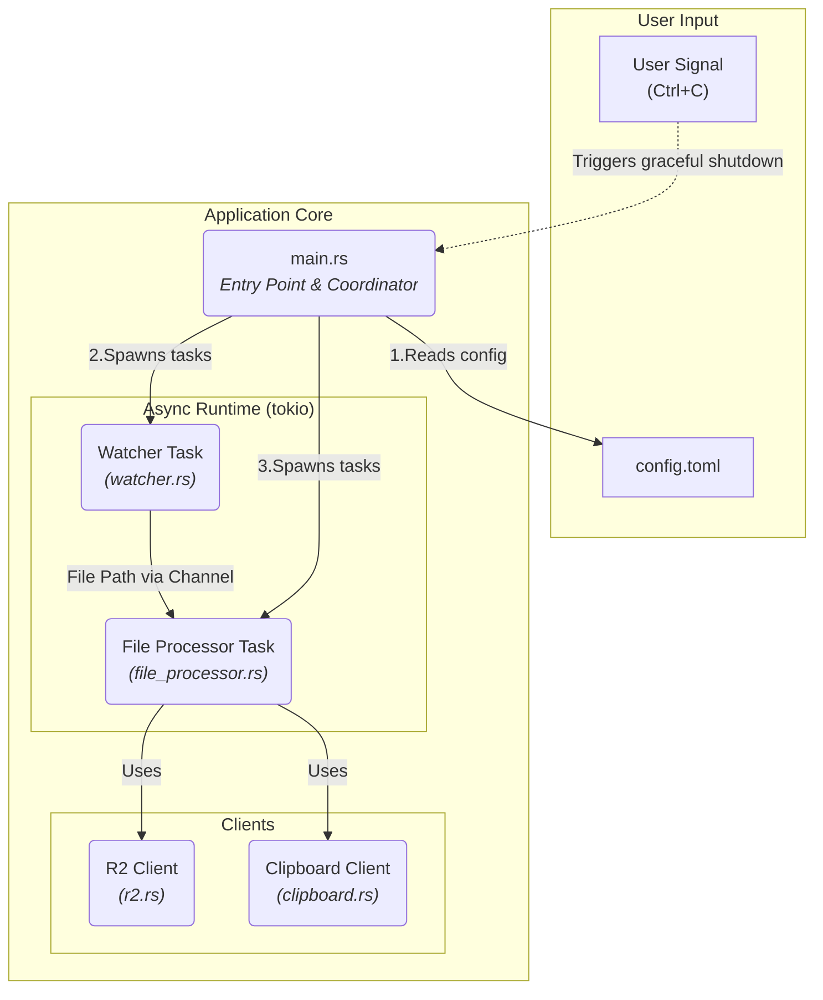

## 1. Design Philosophy

The architecture of this application is designed based on the following principles:

- **Separation of Concerns:** Each component (module) has a single responsibility. Responsibilities such as "loading configuration," "monitoring a folder," "processing files," and "communicating with R2" are clearly separated and implemented as independent modules.
- **Asynchronous Processing:** To efficiently handle I/O-bound operations with long wait times, such as file access and network communication, `tokio` is adopted as the asynchronous runtime. All major operations will be executed as non-blocking async tasks.
- **Loosely Coupled Components:** Dependencies between modules are minimized. In particular, the core file processing logic is decoupled from external services like the R2 client and the clipboard, interacting through an abstracted interface to enhance testability.
- **Message-Based Communication:** The component that monitors for files and the component that processes them will communicate via an asynchronous channel (`tokio::sync::mpsc`). This decouples the watcher and processor tasks, facilitating future extensions such as parallelizing the processing tasks.
- **Centralized Error Handling:** A custom application-specific error type is defined using the `thiserror` crate, making it easy to trace where and what kind of error occurred.

## 2. Architecture Overview Diagram

The data flow and component relationships are as follows:



## 3. File Structure
The project root directory will be structured as follows:

```
r2-uploader/
├── .gitignore
├── Cargo.toml
├── README.md
├── config.toml.example  # Configuration file template
└── src/
    ├── main.rs          # Application entry point, task coordination
    ├── error.rs         # Defines the custom `AppError` type
    ├── config.rs        # Configuration loading and validation
    ├── watcher.rs       # Folder monitoring logic
    ├── file_processor.rs # Single file processing pipeline
    ├── r2.rs            # Client for Cloudflare R2 communication
    └── clipboard.rs     # Clipboard operations
```

## 4. Component / Module Details
`src/main.rs`
- Responsibility: Manages application startup, initialization, and coordination of all components.
- Features:
  - Initializes the logging facility (e.g., `tracing`).
  - Calls `config::load()` to read the configuration and wraps it in an `Arc<Config>` to be shared safely across tasks.
  - Creates a `tokio::sync::mpsc::channel` to establish a communication path between the watcher and processor tasks.
  - Spawns the `watcher` and `file_processor` modules as separate asynchronous tasks (`tokio::spawn`).
  - Listens for a Ctrl+C signal to manage the graceful shutdown of the application.

`src/error.rs`
- Responsibility: Defines a unified error type for the entire application.
- Features:
  - Defines an enum `AppError` using `thiserror::Error`.
  - It's designed to encapsulate various kinds of errors, such as `ConfigError`, `IoError`, `R2Error`, `ImageError`, `ClipboardError`, etc.
  - Exposes a type alias like `pub type Result<T> = std::result::Result<T, AppError>;`.

`src/config.rs`
- Responsibility: Handles loading, parsing, and validating `config.toml`.
- Features:
  - Defines the `Config` struct using `serde::Deserialize`.
  - Provides a `load()` function to read the configuration file and deserialize it into a `Config` struct.
  - Performs basic validation, such as checking if `watch_folder` exists.

`src/watcher.rs`
- Responsibility: Monitors the specified folder and notifies of file creation events.
- Features:
  - Uses the `notify` crate to asynchronously monitor the folder.
  - When a file creation event is detected, it sends the file's `PathBuf` to the `file_processor` via an `mpsc::Sender`.
  - Implements debouncing to handle bursts of events that can occur in a short time.

`src/file_processor.rs`
- Responsibility: Executes the series of operations defined in the requirements for a single file received from the watcher.
- Features:
  - Runs a loop that receives file paths from an `mpsc::Receiver`.
  - For each received file, it executes the following processing pipeline:
    - Hash Calculation: Computes the SHA-256 hash of the file using `sha2`.
    - Duplicate Check: Checks if a file with the same hash already exists on R2 via the `r2::client`.
    - Content Processing:
      - For images: Decodes with `image` and encodes to AVIF with a crate like `ravif`.
      - For videos: Reads the file content directly into memory.
    - Upload: Uploads the processed data to R2 using the `r2::client`.
    - Clipboard Integration: Calls the `clipboard` module to copy the generated public URL.
    - Post-processing: Moves the original file to the `done` folder on success, or to the `error` folder on failure.
  - It receives dependencies like the `R2Client` and `Arc<Config>` as function arguments (Dependency Injection) to ensure testability.

`src/r2.rs`
- Responsibility: Encapsulates all logic related to communication with Cloudflare R2.
- Features:
  - Defines an `R2Client` struct that holds an `aws-sdk-s3::Client` internally.
  - Provides a `new()` function that initializes the S3 client from the configuration info.
  - `upload()`: An async function to upload a byte stream to R2.
  - `object_exists()`: An async function to check if an object with a given key exists.

`src/clipboard.rs`
- Responsibility: Abstracts the write operations to the OS clipboard.
- Features:
  - Wraps the `arboard` crate to provide a simple interface like `set_text(text: &str)`.
  - Handles any errors that might occur during clipboard initialization.
